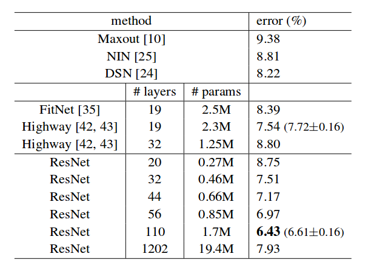
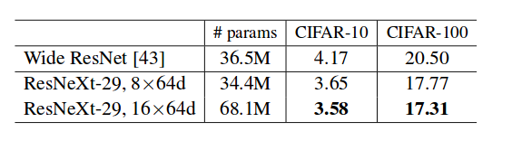

# DenseNet / ResNet / ResNetXt On Cifar10

Thanks [A PyTorch implementation of DenseNet. ](https://github.com/bamos/densenet.pytorch)

ResNet paper results:

ResNet20: Test set: Average loss: 0.2578, Error: 720/10000 (7%)

ResNet56: Test set: Average loss: 0.2715, Error: 568/10000 (6%)

ResNetXt29: Test set: Average loss: 0.1428, Error: 372/10000 (4%)

Densenet100: Test set: Average loss: 0.2084, Error: 477/10000 (5%)

Deform ResNet56(one stage): Test set: Average loss: 0.2658, Error: 553/10000 (6%)

Deform ResNet56(two stage): Test set: Average loss: 0.2177, Error: 477/10000 (5%)

